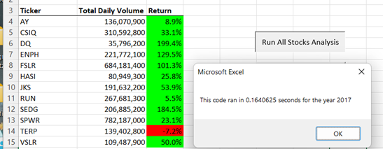
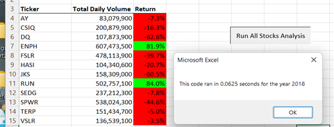
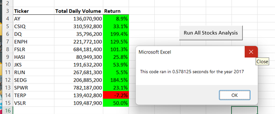
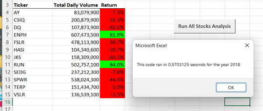

# VBA_Challenge

## Overview of Project

   The VBA Challenge was an Excel project which used a existing data file containing two years of stock reports.   The purpose of 
this challenge was to write a macro that completed the analysis of the stock data and placed the information into a final chart.   The 
final chart shows the Ticker, the Total Daily volume, and the Return in percent of the stocks.   The dates for the daily volume were 
taken from January 01 till December 31 for both the 2017 stock year and the 2018 stock year.   Fially, the run time for the macro was also.
determined.

## Analysis and Challenge

In order to create a macro for the stocks, the correct tickers needed to be initialized.   A variable was created 
and set as a string.   Then the tickers array was created setting each ticker value.

 
    Dim tickers(12) As String
    
     tickers(0) = "AY"
     tickers(1) = "CSIQ"
     tickers(2) = "DQ"
     tickers(3) = "ENPH"
     tickers(4) = "FSLR"
     tickers(5) = "HASI"
     tickers(6) = "JKS"
     tickers(7) = "RUN"
     tickers(8) = "SEDG"
     tickers(9) = "SPWR"
     tickers(10) = "TERP"
     tickers(11) = "VSLR"
    
    
  The worksheet(yearValue) was made active and the RowCount was determined by using the boiler plate below.
    
     RowCount = Cells(Rows.Count, "A").End(xlUp).Row 
    
    
  The tickerIndex variable was created and then initialized as zero.  Three other variables tickerVolumes,
  tickerStartPrices, and tickerEndingPrices were created and set with the correct data type.
   
    Dim tickerIndex As Integer
    
    tickerIndex = 0
    
    Dim tickerVolumes(12) As Long
    
    Dim tickerStartingPrices(12) As Single
    
    Dim tickerEndingPrices(12) As Single
    
  A For loop was then created to initialize the tickerVolumes to run through the ticker names on the spreedsheet.
   
    For i = 0 To 11
    
    tickerVolumes(i) = 0
    
    Next i
    
  In order to loop through all of the rows in the spreedsheet, a For loop was created.  As the rows were looped through, 
  tickerVolumes was added to itself to increase the total tickerVolume of the last column named Volume.
   
    For i = 2 To RowCount
    
      tickerVolumes(tickerIndex) = tickerVolumes(tickerIndex) + Cells(i, 8).Value
      
  Two If statements were used to find the start and end of each tickerIndex.  The first If found the start of the ticker
  in the spreadsheet and the second If found the end.  Once the end of the tickers was found, the tickerIndex was added 
  to move to the next ticker.
   
    If Cells(i - 1, 1).Value <> tickers(tickerIndex) Then
       
       tickerStartingPrices(tickerIndex) = Cells(i, 6).Value
       
    End If
    
    If Cells(i + 1, 1).Value <> tickers(tickerIndex) Then
        tickerEndingPrices(tickerIndex) = Cells(i, 6).Value
        
        tickerIndex = tickerIndex + 1
        
   The active worksheet was changed to All Stocks Analysis.   The chart for the macro was created using the assigned cells 
   for the headers.
   
   
    Worksheets("All Stocks Analysis").Activate
       Cells(4 + i, 1).Value = tickers(i)
       Cells(4 + i, 2).Value = tickerVolumes(i)
       Cells(4 + i, 3).Value = ((tickerEndingPrices(i) - tickerStartingPrices(i)) / tickerStartingPrices(i))
    Next i
    
    
    
   The chart cells values were set using the Range and format below.
   
    
    Worksheets("All Stocks Analysis").Activate
     Range("A3:C3").Font.FontStyle = "Bold"
     Range("A3:C3").Borders(xlEdgeBottom).LineStyle = xlContinuous
     Range("B4:B15").NumberFormat = "#,##0"
     Range("C4:C15").NumberFormat = "0.0%"
     Columns("B").AutoFit   
     
     
   
   The colors of the cell types were created using a for loop.   
   

     dataRowStart = 4
     dataRowEnd = 15
   
     For i = dataRowStart To dataRowEnd
     
        If Cells(i, 3) > 0 Then 
           Cells(i, 3).Interior.Color = vbGreen    
        Else
           Cells(i, 3).Interior.Color = vbRed
        End If    
      Next i
     
    
    
   In order to calculate the elapsed time for running the macro, the following code was used.   Here we have the dataRowsStart
   and dataRowsEnd.
   
   
   
 
      endTime = Timer
      MsgBox "This code ran in " & (endTime - startTime) & " seconds for the year " & (yearValue)
      
      
      
      
   The images below show the elapse time for the refactered macro code for the 2017 and 2018 years.   
    
      
      

   
   The images below show the original macro code for the 2017 and 2018 years.
   
   
   

## Results

The elapse time for the refactored macro was important for longer data sets in the future.   If all 
stocks in the stock market were being evaluated, the difference in run times would be significate.   
For the purpose of this macro, the time was not as significante with the total time for both being 
under 1 second.   The importance of the color coding and formating fthe font enabled the data to be  
interpreted faster andget a better comparision visually.

   
   
   
 ## Summary
   
   
   
   For the macro we created, the refactoring significantly reduced the elaspe time for both the 2017
 and 2018 years.The original macro used a nested For loop to loop through all of the tickers(i) and 
 then add the totalVolume of the ticker Cells.
   
   
    If Cells(j, 1).Value = ticker Then
      totalVolume = totalVolume + Cells(j, 8).Value   
    End If

  It then used another for loop to check for the starting and ending tickerVolume.

    If Cells(j - 1, 1).Value <> ticker And Cells(j, 1).Value = ticker Then
      startingPrice = Cells(j, 6).Value  
    End If
   
   

    If Cells(j + 1, 1).Value <> ticker And Cells(j, 1).Value = ticker Then
      endingPrice = Cells(j, 6).Value   
    End If
   
   

   This slowed the macro down due to the amount of loops to complete the macro function.   
   With the refactored macro, the smae code was changed to run quicker.   The tickerVolume,
   tickerStartingPriceses and the tickerEndingPrices variables were created.    The variables
   were set to increase as the cell volume was counted.
   
   
   
   
      tickerVolumes(tickerIndex) = tickerVolumes(tickerIndex) + Cells(i, 8).Value
   
   
   
   
  Then the start and end cells for the ticker were found using the following If statment.
   
   
   
   
   
      If Cells(i - 1, 1).Value <> tickers(tickerIndex) Then
       tickerStartingPrices(tickerIndex) = Cells(i, 6).Value
      End If
    
    
    
    
    
   By doing this, is combined the loops for faster evaluation.
   
   
   
